# quarkus 프로젝트 시작! (학번 : 20231028 이름 :최민 )
매 주 수업 내용을 정리하자.

## 2, 3주차 수업 내용
실습 1 : 쿼크스 환경 구축 및 준비 완료!
실습 2 : HTML 기본 및 LOL 메인 화면 개발 완료!
• 스크린샷 폴더 생성

## 4주차 수업 내용
실습 1 : Bootstrap 5 연결하고 HTML 문서 구조 제대로 이해하기
실습 2 : 태그와 class의 차이를 구분하며 LOL 메인 화면 구조 분석하기
실습 3 : 하이퍼링크와 이미지 연결하고 로컬 경로 적용하기
실습 4 : 개발자 모드(F12)로 CSS 선택자와 우선순위 확인하기
실습 5 : 네비게이션 바를 새 디자인으로 바꾸고 드롭다운 메뉴 추가하기
실습 6 : 챔피언 카드를 수정하고 버튼까지 넣어 더 완성도 있게 만들기
실습 7 : 모달창과 iframe을 활용해 챔피언 상세 페이지 연결하기
실습 8 : modals 폴더와 상대 경로를 이해하고 이미지 오류 해결하기
실습 9 : 뉴스, 챔피언, 다운로드, 로그인용 서브 페이지 구조 설계하기
실습 10 : 다운로드 페이지를 만들며 배너, 버튼, 표까지 구현하기
실습 11 : CSS 파일 분리와 배경 이미지 적용으로 화면을 더 깔끔하게 정리하기
실습 12 : 반응형 시스템 사양 표를 추가하며 서브 페이지 완성도 높이기

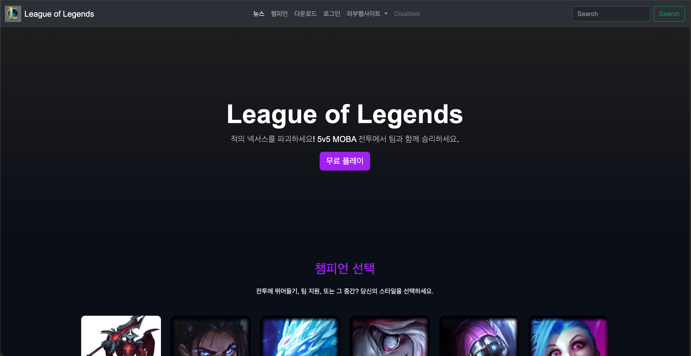
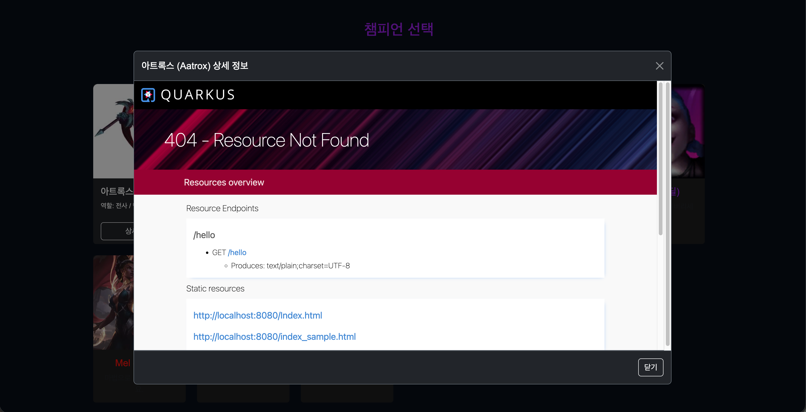
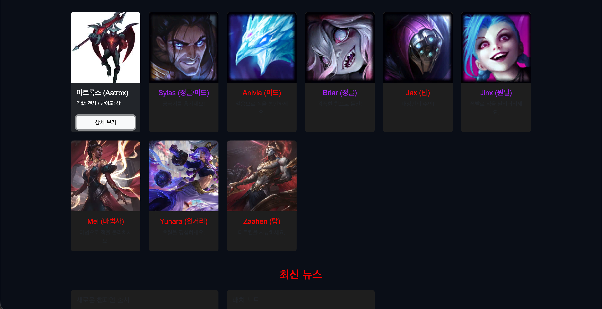

## 5주차 수업 내용
카드에 정보와 버튼 넣기  
버튼 누르면 뜨는 모달 구조 만들기  
모달 안에 iframe으로 상세 페이지 넣기  
modals 폴더 만들고 상대 경로 수정하기  
뉴스/챔피언/다운로드/로그인 서브 페이지 구조 설계하기  
download.html 만들어 기존 레이아웃 재사용하기  
다운로드 배너와 버튼 추가하기  
download.css 파일로 스타일 분리하기  
배경 이미지와 Flexbox 적용하기  
반응형 시스템 사양 표 추가하기  

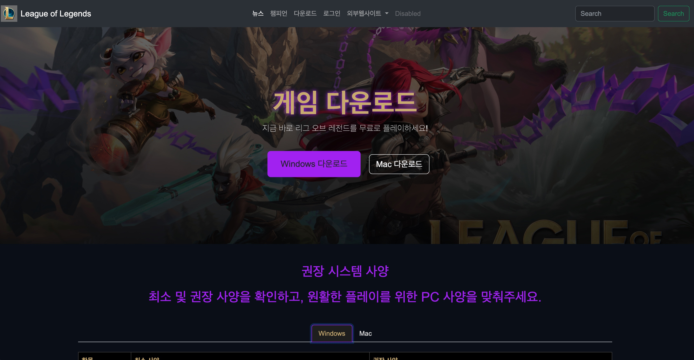
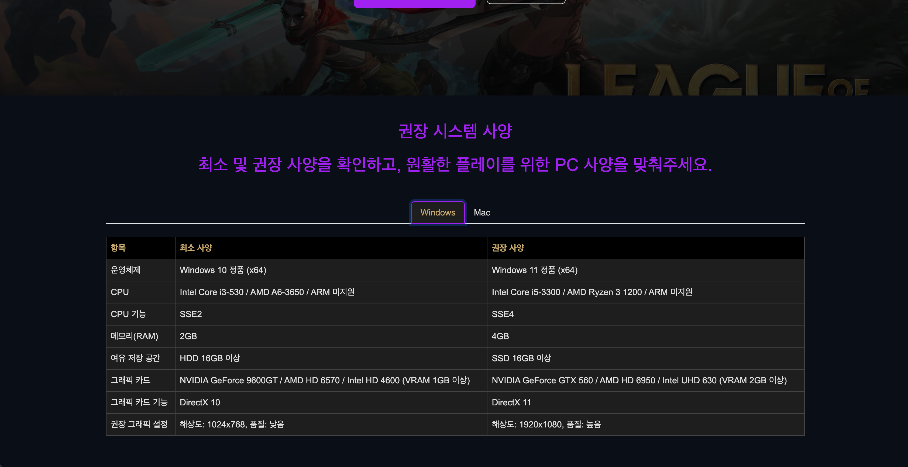
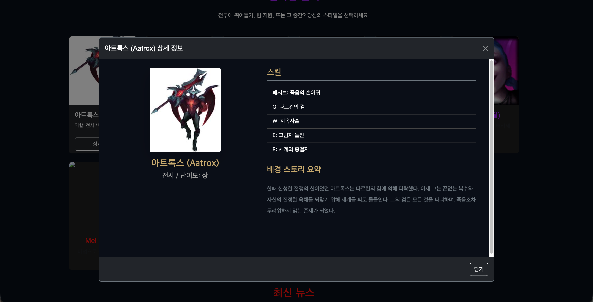

## 6주차 수업 내용
재할당 해야하는건 let, 상수 즉 원주율 같은(3.14)같은 애들은 const를 사용
자바스크립트의 역할과 웹에서의 동작 방식 이해하기
Bootstrap JS 연결 방식과 script 태그 사용법 익히기
var, let, const 차이와 호이스팅 개념 배우기
검색 기능 준비하기
form, submit, preventDefault를 활용
DOM 구조이해하기
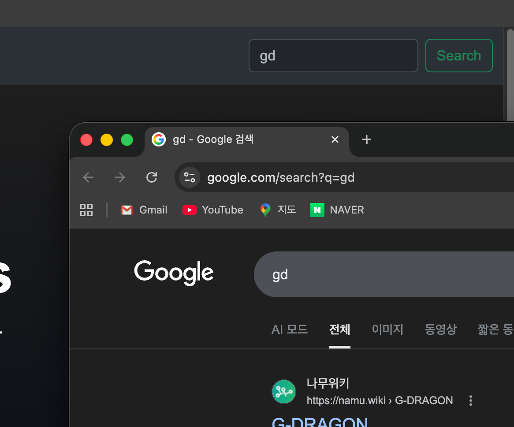
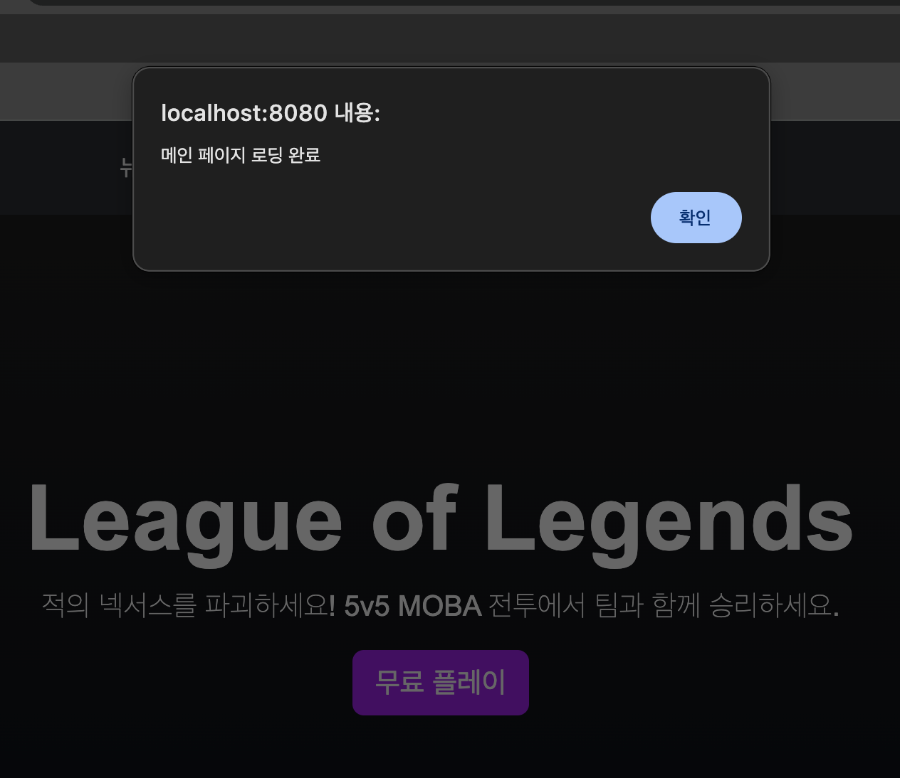

## 7주차 수업 내용 — 자바스크립트 기초 & LOL 기능 구현

> ## 📝 추가 설명
> 중간에 여러 주차의 파일들이 서로 꼬여서 정리가 어려웠다.
> 그래서 다시 처음부터 차근차근 공부하면서 7주차까지의 내용만 깔끔하게 정리한 뒤 커밋했다.

### PART 1. 트렌드 / 이론 (자바스크립트 개요)
- **역할**: HTML(구조) · CSS(뷰)에 더해, 자바스크립트는 "연결과 동작"을 담당한다. (예: 버튼을 누르면 불이 켜진다)
- **특징**: 인터프리터 언어이자 (함수 + 객체) 지향 언어. 웹/모바일/백엔드 전 분야에 쓰여 범용성·호환성이 높다.
- **실행 엔진**: 웹 브라우저에 JS 전용 엔진이 내장됨 → 대표적으로 구글 크롬 **V8 엔진(표준)**.
- 스택/큐/GC(가비지 컬렉션) 등 메모리 관리가 대부분 자동화되어 있다.
- **트렌드**: 클라이언트(브라우저) JS 실행을 최소화하고 성능을 최적화하는 방향.

### PART 2. 자바스크립트 기초 문법
**① JS 연동 방식 4가지 (`js/test.js`, `Index.html` head)**

| 방식 | 작성 예 | 비고 |
|------|---------|------|
| 인라인 (Inline) | `<a onclick="alert('hi')">` | 간단하지만 유지보수·재사용 어려움, 보안 이슈(XSS) → 비권장 |
| 내부 (Internal) | `` | HTML 내부 작성, 파일이 비대해짐 |
| **외부 (External)** | `` 로 연결.

**② `var` / `let` / `const` 비교 (`js/test.js`)**

| 구분 | var | let | const |
|------|-----|-----|-------|
| 도입 | ES5 | ES6(2015) | ES6(2015) |
| 재선언 | 가능 | 불가 | 불가 |
| 재할당 | 가능 | 가능 | **불가** |
| 스코프 | 함수 스코프 | 블록 스코프 | 블록 스코프 |
| 호이스팅 | O (undefined로 초기화) | O (TDZ 발생) | O (TDZ 발생) |

- **재할당이 필요하면 `let`**, 원주율(3.14)처럼 변하지 않는 상수는 `const`를 사용.
- **호이스팅**: 코드 실행 전 선언부를 스코프 상단으로 끌어올리는 동작. ES6 이후 `let`/`const`는 **TDZ**가 적용되어 선언 전 접근 시 `ReferenceError`가 발생한다.

### PART 3. LOL 기능 구현 — 실시간 챔피언 검색
**① 검색 1단계 (구글 검색)**
- `Index.html`의 검색 `form`에 `id`(`searchForm`, `searchInput`)를 부여하고 `js/search.js`를 최하단에 연동.
- `submit` 이벤트에서 `preventDefault()`로 새로고침을 막고, `window.open()`으로 구글 검색 결과를 새 탭에 출력.
- (2단계 구현 후 이 코드는 주석 처리)

**② DOM(Document Object Model)**
- HTML 문서를 **트리 구조**로 변환해 관리하는 표준 구조. 최상위 객체는 `document`.
- 자바스크립트로 문서의 구조·스타일·내용을 동적으로 변경할 수 있다.

**③ 검색 2단계 (사이트 내부 검색) — 핵심**
- `<style>`에 있던 사용자 정의 디자인을 `css/main.css`로 **분리**하고 `<link rel="stylesheet" href="css/main.css">`로 연동.
- `Index.html` 뉴스 섹션 아래에 **검색 결과 섹션(`#searchResults`)** 추가 (좌측 카테고리 사이드바 + 우측 결과 영역).
- `search.js`에 데이터와 로직 작성:
  - `CHAMPIONS`(챔피언 객체 배열), `NEWS`(뉴스 객체 배열)
  - `performSearch(query)` : `filter()`로 이름/영문명/역할/라인을 검색 → 결과 카드 생성, 카운트 표시, 히어로·기존 섹션 숨기고 결과 섹션 표시
  - `switchCategory(type)` : 챔피언/뉴스 탭 전환
- 검색하면 **새 탭이 아니라 사이트 내부**에서 결과가 출력된다.

### PART 4. 마무리 & 과제
- ✅ **새 챔피언 3개 이상 추가** : 멜(Mel)·자헨(Zaahen)·유나라(Yunara)를 `CHAMPIONS`에 추가하여 검색으로 찾을 수 있게 함.
- ✅ **`showMainScreen()` 추가** : 검색어가 비었거나 공백이면 검색 결과를 닫고 메인 화면으로 복귀하도록 구현. `performSearch`에서 `q`가 없으면 호출.

---

## 실제 실행 화면 (http://localhost:8080/)

**① 메인 화면 — 챔피언 카드 & 상세 보기 버튼**

**② 챔피언 상세 모달 (iframe) — 능력치 · 스킬 · 배경 스토리**
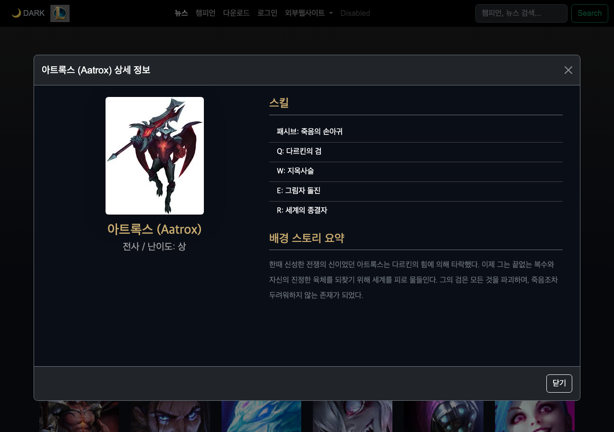

**③ 실시간 검색 결과 — "아트록스" 검색 (카테고리 사이드바 + 결과 카드)**
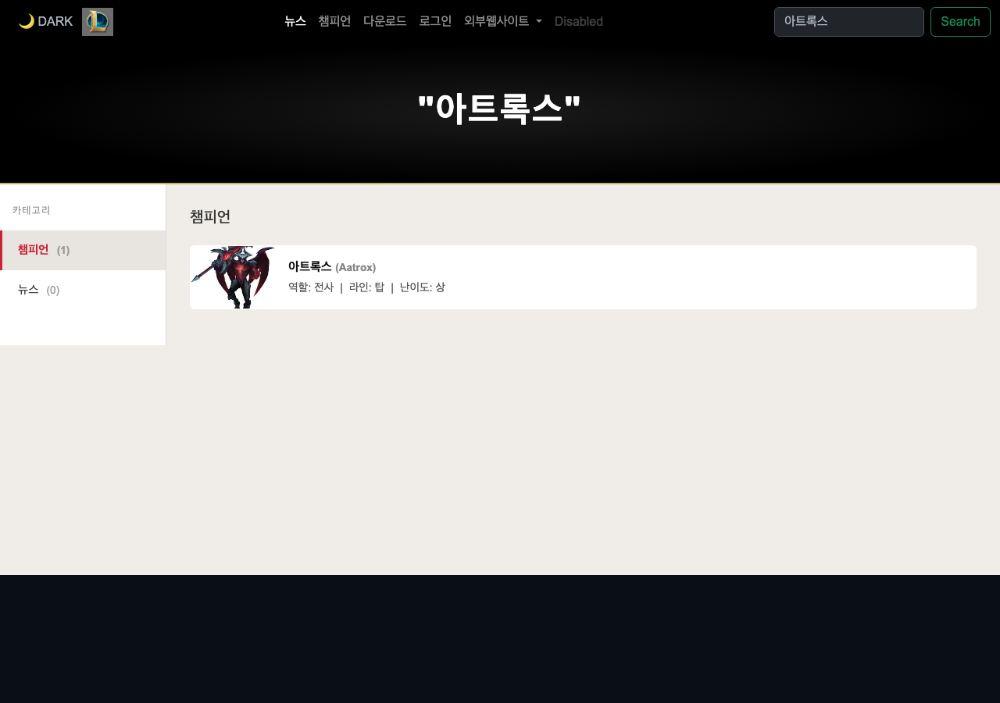

---

## 9주차 수업 내용 — JS 기능 추가 & MySQL 연동

### PART 1. 트렌드 / 이론 (V8 엔진 심화 · WebAssembly)
- **V8 엔진**: 단순 인터프리터 → **다단계 컴파일러(JIT)** 구조.
  - `Parser → AST → Ignition(바이트코드 인터프리터) → TurboFan(Hot Code 최적화 컴파일러) → 네이티브 기계어`
  - 자주 실행되는 코드를 감지해 최적화하므로 네이티브 대비 약 50~80% 성능까지 도달.
- **WebAssembly(WASM)**: 비디오 코덱·물리 연산·게임 로직·AI 추론 등 고성능 처리에 사용. 기계어 수준이라 별도 최적화가 거의 필요 없고, V8에서는 `Liftoff(빠른 시작) + TurboFan(최적화)` 조합으로 실행. (예: 유니티 웹 게임)

### PART 2. LOL 기능 추가 (JavaScript)
**① 자료 구조 비교 (`js/test2.js`)**

| 구분 | 객체 배열 `[{key:value}]` | 일반 배열 `[value, value]` |
|------|--------------------------|----------------------------|
| 데이터 의미 | 키로 의미 파악 명확 (`news[0].title`) | 인덱스 순서를 미리 약속해야 함 (`news[0]`) |
| 접근/가공 | 조건 필터링·속성 추가에 유리 | 단순 순회·존재 확인(`includes`)이 빠름 |
| 추천 상황 | DB 검색 결과, 게시판 글 목록 | 단순 선택지·태그·점수 목록 |

**② 다크 / 라이트 모드 전환**
- `Index.html` 네비게이션 바에 토글 버튼(`#themeToggleBtn`) 추가.
- `css/main.css`에 `body.light-mode` 라이트 모드 색상(배경/네비/카드/히어로) 추가.
- `js/toggle.js`의 `toggleTheme()`가 `classList.toggle('light-mode')`로 테마를 한 번에 전환하고, 버튼 텍스트(🌙 DARK ↔ ☀️ LIGHT)와 네비바 부트스트랩 클래스를 교체.

### PART 3. 데이터베이스 연동 (MySQL)
- **의존성(`pom.xml`)**: `quarkus-jdbc-mysql`(드라이버), `quarkus-hibernate-orm-panache`(ORM), `quarkus-rest-jackson`(JSON 변환).
- **설정(`application.properties`)**: `db-kind=mysql`, `root` 계정, `jdbc:mysql://localhost:3306/lol`, `hibernate-orm.database.generation=update`(테이블 자동 생성), `log.sql=true`.
- **백엔드 3계층 패턴** (`src/main/java/org/acme`):

| 파일 | 역할 | 레이어 |
|------|------|--------|
| `champion/Champion.java` | `@Entity` + `extends PanacheEntity` → 테이블 매핑(id 자동) | Model |
| `champion/ChampionResource.java` | `@Path("/champions")` GET(목록)/POST(추가) API | Controller |
| `common/DataSeeder.java` | `@Observes StartupEvent`로 서버 시작 시 챔피언 초기 데이터 삽입 | Initializer |

- **확인**: 서버 실행 후 `http://localhost:8080/champions` 에서 DB의 챔피언 목록이 **JSON**으로 응답된다. (개발자 보드: `http://localhost:8080/q/dev/`)

### PART 4. 마무리 & 과제
- ✅ **과제1 — 검색 결과 모달**: `search.js`의 챔피언 데이터에 `modalId` 속성을 추가하고, 검색 결과 카드에 `data-bs-toggle="modal"` / `data-bs-target="#modalXxx"` 버튼을 넣음. 모달이 검색 화면 위에서도 열리도록 모달 `
`들을 챔피언 섹션 **밖(body 하단)으로 이동**.
- ✅ **과제2 — 이벤트 리스너 방식**: 토글 버튼을 `onclick`(인라인) → `addEventListener`(리스너) 방식으로 변경. `toggle.js`만 연동하면 자동으로 클릭 이벤트가 등록되며, **다운로드 페이지(`download.html`)에도 공통 적용**.

---

## 9주차 실제 실행 화면 (http://localhost:8080/)

**① 라이트 모드 전환 (☀️ LIGHT)**
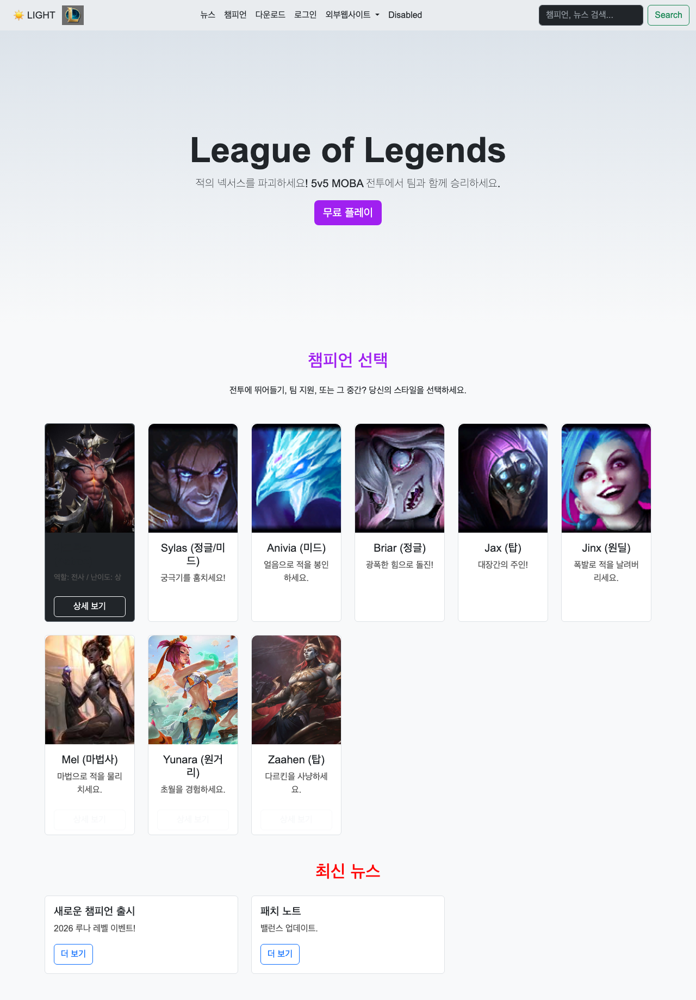

**② 검색 결과에서 챔피언 모달 열기 (과제1)**
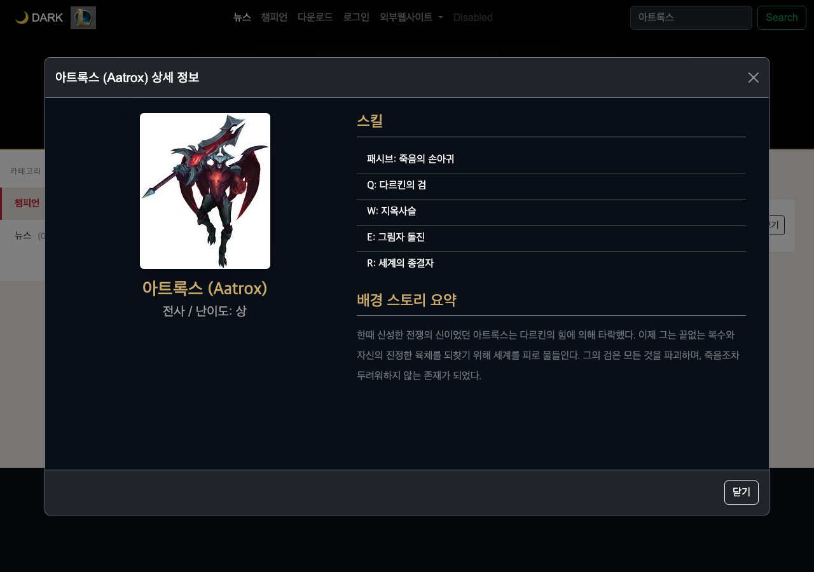

**③ MySQL 데이터 JSON 응답 — /champions**
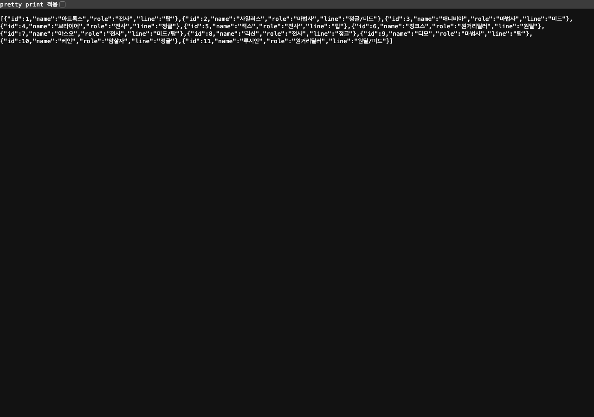

---

