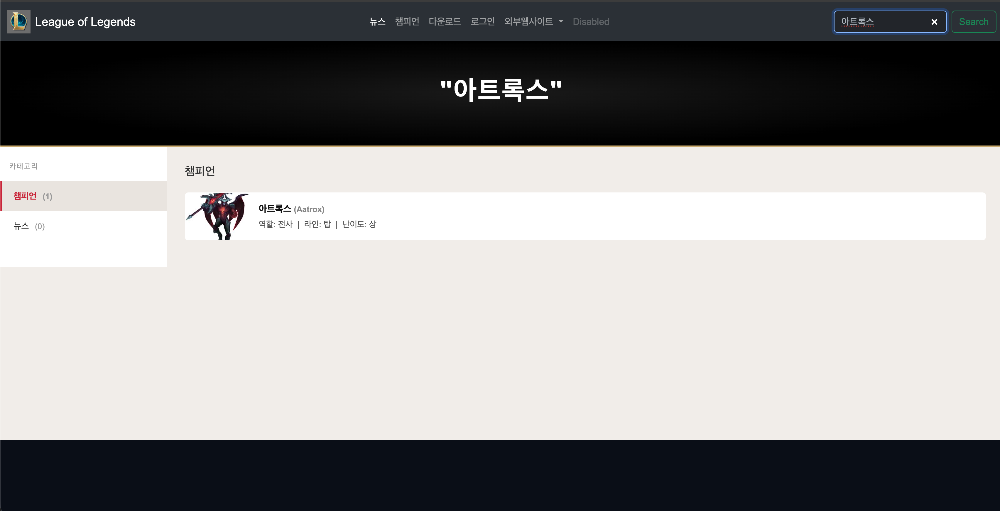
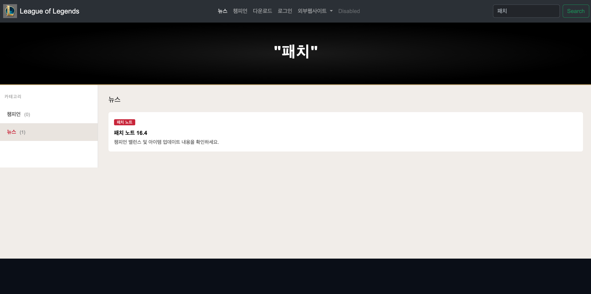
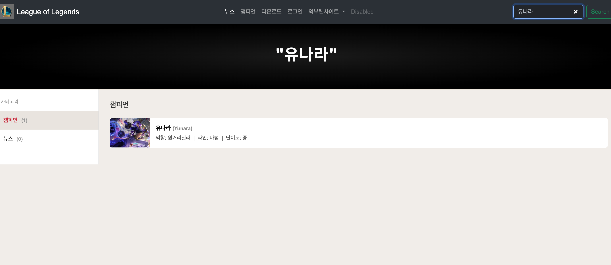
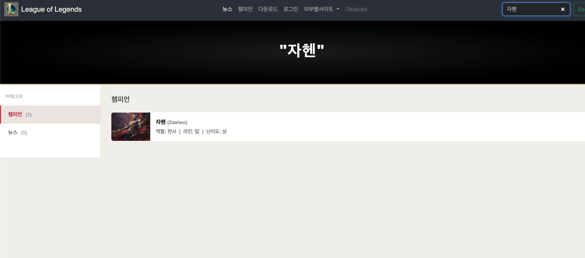
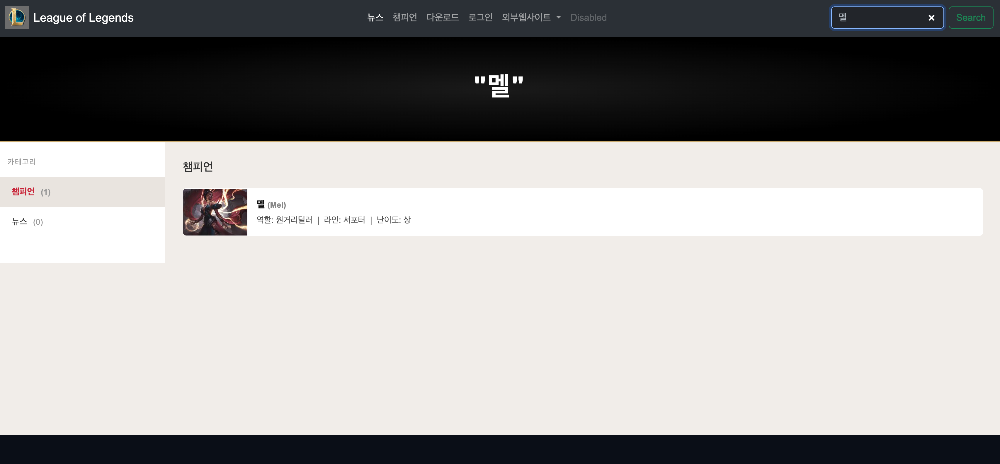

# quarkus 프로젝트 시작! (학번 : 20231028 이름 :최민 )
매 주 수업 내용을 정리하자.

## 2, 3주차 수업 내용
실습 1 : 쿼크스 환경 구축 및 준비 완료!
실습 2 : HTML 기본 및 LOL 메인 화면 개발 완료!
• 스크린샷 폴더 생성

## 4주차 수업 내용
실습 1 : Bootstrap 5 연결하고 HTML 문서 구조 제대로 이해하기
실습 2 : 태그와 class의 차이를 구분하며 LOL 메인 화면 구조 분석하기
실습 3 : 하이퍼링크와 이미지 연결하고 로컬 경로 적용하기
실습 4 : 개발자 모드(F12)로 CSS 선택자와 우선순위 확인하기
실습 5 : 네비게이션 바를 새 디자인으로 바꾸고 드롭다운 메뉴 추가하기
실습 6 : 챔피언 카드를 수정하고 버튼까지 넣어 더 완성도 있게 만들기
실습 7 : 모달창과 iframe을 활용해 챔피언 상세 페이지 연결하기
실습 8 : modals 폴더와 상대 경로를 이해하고 이미지 오류 해결하기
실습 9 : 뉴스, 챔피언, 다운로드, 로그인용 서브 페이지 구조 설계하기
실습 10 : 다운로드 페이지를 만들며 배너, 버튼, 표까지 구현하기
실습 11 : CSS 파일 분리와 배경 이미지 적용으로 화면을 더 깔끔하게 정리하기
실습 12 : 반응형 시스템 사양 표를 추가하며 서브 페이지 완성도 높이기

## 5주차 수업 내용
카드에 정보와 버튼 넣기  
버튼 누르면 뜨는 모달 구조 만들기  
모달 안에 iframe으로 상세 페이지 넣기  
modals 폴더 만들고 상대 경로 수정하기  
뉴스/챔피언/다운로드/로그인 서브 페이지 구조 설계하기  
download.html 만들어 기존 레이아웃 재사용하기  
다운로드 배너와 버튼 추가하기  
download.css 파일로 스타일 분리하기  
배경 이미지와 Flexbox 적용하기  
반응형 시스템 사양 표 추가하기  

## 6주차 수업 내용
재할당 해야하는건 let, 상수 즉 원주율 같은(3.14)같은 애들은 const를 사용
자바스크립트의 역할과 웹에서의 동작 방식 이해하기
Bootstrap JS 연결 방식과 script 태그 사용법 익히기
var, let, const 차이와 호이스팅 개념 배우기
검색 기능 준비하기
form, submit, preventDefault를 활용
DOM 구조이해하기

## 7주차 수업 내용
검색창에 검색시 구글로 이동하여 검색하게 했었는데 파일 내 serch.js 파일을 사용하여 파일 내에서 검색하도록 만듬
(롤 기능 구현하기 코드를 잘 확인하면 시험에 좋다.)

---
## 7주차 실습 과제
새로운 챔피언 추가 검색기능으로 찾을 수 있음

## 9주차 수업 내용
네비게이션바에서 토글을 연결해 글자를 선택하면 다크, 화이트 모드로 변경되도록 설정.
DB의 연결과 현재 내가 만든 코드들의 파일 상태 확인가능
mysql은 데이터를 주고 받기 위해서 3306으로 설정

## 10주차 수업 내용
웹 보안: 쿠키(웹브라우저에 저장) ex:장바구니
개인정보는 백엔드 자체 DB에 저장이 된 후 꺼내올 수 있도록 해야함. (다운로드 서버 창과 다름)
로그인 창만든 후 로그인 창을 만들고 네비세이션바를 그대로 갖고 와서 로그인 파일에 넣는다.
AuthResource.java 파일에 login.html 파일에서 값을 받으면 파라미터가 되도록 값을 다시 받는 코드를 넣는다.
extend= panacheEntity라이브러리에서 만들어진 함수를 갖다 쓸 수 있다.

