# quarkus 프로젝트 시작! (학번 : 20231028 이름 :최민 )
매 주 수업 내용을 정리하자.

## 2, 3주차 수업 내용 — 개발 환경 구축 & HTML/CSS 기초
> 실습 1 : 쿼크스 환경 구축 및 준비 완료! / 실습 2 : HTML 기본 및 LOL 메인 화면 개발 완료! (• 스크린샷 폴더 생성)

### PART 1. 트렌드 / 이론
- **AI 웹 개발 트렌드**: 코드 자동 완성·디버깅·UI 제안(ChatGPT·Gemini·Copilot 등), 저코드/노코드 도구 증가 → 개발 속도 향상.
- **Quarkus**: 클라우드 네이티브 **Java 백엔드 프레임워크**. 빠른 부팅·낮은 메모리, 컨테이너/쿠버네티스·GraalVM 네이티브 지원. (장점: Spring Boot 대비 빠른 부팅 / 단점: 빌드 시간이 김)

### PART 2. 개발 환경 구축 (Quarkus)
- **설치**: VS Code + 확장(`Quarkus Tools`, `Extension Pack for Java`) + **JDK 21**.
- **프로젝트 실행**: 하단 터미널에서 `./mvnw quarkus:dev` (종료: `Ctrl + C` 또는 `q`). 첫 실행은 빌드 대기.
- **전역 설정** (`application.properties`): `quarkus.http.port=8080`, `quarkus.http.static-resources.index-page=index.html`, `quarkus.test.continuous-testing=disabled`.
- **접속 주소**: 홈 `http://localhost:8080/` (실서비스 포트는 80), 개발 보드 `http://localhost:8080/q/dev-ui/`.
- **정적 파일 위치**: `src/main/resources/META-INF/resources/index.html` 이 홈 첫 화면.

### PART 3. HTML 기본 & LOL 메인 화면 (4단계)
- **HTML 기본 구조**: `<!DOCTYPE html>` → `<html>` → `<head>`(meta·title·link·script) + `<body>`. 기본 태그 `h1, p, ul, li, div, img, a`.
- **메인 화면 단계별 제작**
  1. **골격(태그/문자열)**: h1·p·ul·li로 챔피언 목록, div로 뉴스
  2. **Bootstrap 레이아웃 + 네비바**: CDN `<link>` 연결, `navbar`, `container`/`row`/`col`, `card`
  3. **커스텀 CSS(LOL 다크 테마)**: `<style>`로 배경 `#0a0e17`, 포인트 컬러(`accent-purple`)
  4. **인터랙티브**: `.card:hover { transform: scale(1.05) }` + `transition`, `box-shadow`(보라색 광원), `object-fit: cover`

### 핵심 정리
- **HTML(구조) + CSS(디자인)** 의 역할 구분, Bootstrap은 class 기반 디자인.
- 웹서버는 기본 `index.html`을 로딩, 없는 주소는 **404**.

## 4주차 수업 내용 — HTML/CSS 심화 (Bootstrap·카드·모달·서브페이지)
> 실습 1~12 요약: Bootstrap 5 연결 → 태그/class 구분 → 하이퍼링크·이미지(로컬 경로) → F12 CSS 우선순위 → 네비바/드롭다운 → 챔피언 카드+버튼 → 모달+iframe → modals 상대경로 → 서브페이지 구조 설계 → 다운로드 페이지(배너·버튼·표) → CSS 분리·배경 → 반응형 시스템 사양 표.

### PART 1. Bootstrap 5 & 문서 구조
- **Bootstrap 5**(getbootstrap.kr): class 기반 디자인 프레임워크. `<head>`에 CDN `<link>`로 연결.
- **태그 vs class**: 태그(`<nav>`,`<div>`)=HTML5 요소, class(`navbar`,`card`)=Bootstrap 디자인 속성. (Bootstrap을 `Ctrl+/` 주석 처리하면 디자인이 풀림)
- **`<head>` 3대 요소**: `meta`(전역 정보) · `link`(외부 자원) · `script`(JS 연결).

### PART 2. 하이퍼링크 & 이미지 / 경로
- **하이퍼링크** `<a href="url">` : `target` 4종 → `_self`(현재 탭, 기본) / `_blank`(새 탭) / `_parent` / `_top`.
- **이미지** `` : 외부 URL 또는 **로컬**(`images/` 폴더). **상대 경로 `../`** = 한 단계 상위 폴더. (잘못된 주소 → 404)

### PART 3. CSS 심화 — 선택자 우선순위 (F12)
| 선택자 | 예시 | 우선순위 |
|--------|------|----------|
| 요소 | `div`, `p`, `img` | 낮음 |
| 클래스 | `.card`, `.accent-purple` | 중간 |
| ID | `#championGrid` | 높음 |
| 인라인 | `style="..."` | 더 높음 |
| `!important` | `color:white !important` | **최고** |

### PART 4. 카드 · 모달 · 서브페이지
- **그리드**: `row g-4`(컬럼 간격) / `row-cols-*`(한 행 컬럼 수, 반응형).
- **챔피언 카드**: `card` → `card-img-top`(이미지) + `card-body`(제목/설명) + `card-footer`(상세 보기 버튼).
- **모달 + iframe**: 버튼 `data-bs-toggle="modal"` + `data-bs-target="#modalAatrox"` ↔ 모달 `id`가 상호작용. 모달 body 안 `iframe`으로 `modals/Aatrox.html` 로드. → 이미지 깨짐은 **상대 경로 `../`** 로 해결.
- **서브페이지**: 뉴스(게시판)·챔피언(목록)·다운로드(정보)·로그인(입력). 기존 `index.html`의 네비바/레이아웃을 **복사 재사용**.
- **다운로드 페이지**: 히어로 배너 + Windows/Mac 버튼 + 시스템 사양 **반응형 표**(`<tr>`=행, `<td>`=셀). `<style>` → `download.css` 분리(배경 이미지·그라데이션·**Flexbox**).


## 5주차 수업 내용 — 카드·모달 완성 & 서브페이지(다운로드)
> 4주차에 이어 LOL 프로젝트의 **카드 → 모달 → 서브페이지(다운로드)** 를 완성한 주차.

### 1) 챔피언 카드 & 모달
- 카드에 정보(이름·역할·난이도)와 **상세 보기 버튼** 추가.
- 버튼 클릭 → **모달(modal)** 팝업 → 모달 안 **`iframe`** 으로 상세 페이지(`modals/*.html`) 표시.
- `modals/` 폴더 생성 후 이미지 경로를 **상대 경로(`../`)** 로 수정해 깨짐 해결.

### 2) 서브페이지 구조 설계
- 뉴스 / 챔피언 / **다운로드** / 로그인 페이지로 구획.
- `download.html`은 기존 `index.html`의 **네비바·레이아웃을 재사용**(복사 후 본문만 교체).

### 3) 다운로드 페이지 완성
- 상단 **다운로드 배너(히어로)** + 다운로드 버튼.
- `<style>` 인라인 → **`download.css` 파일로 분리**(`<link>` 연결).
- **배경 이미지 + 그라데이션 + Flexbox** 레이아웃 적용.
- 최하단 **반응형 시스템 사양 표** 추가(화면 크기에 따라 정렬 변화, OS별 탭).

### 핵심 정리
- **재사용**: 공통 헤더/네비바/푸터는 복사해 모든 페이지에서 사용.
- **분리**: HTML(구조)·CSS(스타일)를 파일로 분리하면 유지보수가 쉬움.


## 6주차 수업 내용 — 자바스크립트 기초 (입문)
> JavaScript의 역할과 기본 문법을 익히고, 검색 기능을 위한 준비를 한 주차. (실제 검색 구현은 7주차)

### 1) JavaScript의 역할
- HTML(구조) · CSS(뷰)에 더해 JS는 **동작·연결**을 담당 (예: 버튼 클릭 시 반응).
- 브라우저가 JS를 직접 실행(인터프리터). **Bootstrap JS** 연결은 `<script>` 태그로(보통 `<body>` 최하단).

### 2) 변수 — `var` / `let` / `const`
- **재할당이 필요하면 `let`**, 원주율(3.14)처럼 **변하지 않는 상수는 `const`**, `var`는 옛 방식.
- **호이스팅**: 선언이 스코프 위로 끌어올려지는 동작. `let`/`const`는 선언 전 사용 시 오류(TDZ).

### 3) 이벤트 & DOM (검색 기능 준비)
- **DOM**: HTML 문서를 **트리 구조**로 표현(최상위 `document`). JS로 요소를 찾아(`getElementById`) 조작.
- **폼 이벤트**: `form` 제출(`submit`) 시 **`preventDefault()`** 로 새로고침을 막고 JS 로직 실행.

```js
document.getElementById('searchForm').addEventListener('submit', function (e) {
    e.preventDefault();                 // 폼 기본 동작(새로고침) 차단
    const q = document.getElementById('searchInput').value;
    // ... 검색 로직 (7주차에서 구현) ...
});
```


## 7주차 수업 내용 — 자바스크립트 기초 & LOL 기능 구현

> ## 📝 추가 설명
> 중간에 여러 주차의 파일들이 서로 꼬여서 정리가 어려웠다.
> 그래서 다시 처음부터 차근차근 공부하면서 7주차까지의 내용만 깔끔하게 정리한 뒤 커밋했다.


### PART 1. 트렌드 / 이론 (자바스크립트 개요)
- **역할**: HTML(구조) · CSS(뷰)에 더해, 자바스크립트는 "연결과 동작"을 담당한다. (예: 버튼을 누르면 불이 켜진다)
- **특징**: 인터프리터 언어이자 (함수 + 객체) 지향 언어. 웹/모바일/백엔드 전 분야에 쓰여 범용성·호환성이 높다.
- **실행 엔진**: 웹 브라우저에 JS 전용 엔진이 내장됨 → 대표적으로 구글 크롬 **V8 엔진(표준)**.
- 스택/큐/GC(가비지 컬렉션) 등 메모리 관리가 대부분 자동화되어 있다.
- **트렌드**: 클라이언트(브라우저) JS 실행을 최소화하고 성능을 최적화하는 방향.

### PART 2. 자바스크립트 기초 문법
**① JS 연동 방식 4가지 (`js/test.js`, `Index.html` head)**

| 방식 | 작성 예 | 비고 |
|------|---------|------|
| 인라인 (Inline) | `<a onclick="alert('hi')">` | 간단하지만 유지보수·재사용 어려움, 보안 이슈(XSS) → 비권장 |
| 내부 (Internal) | `<script> ... </script>` | HTML 내부 작성, 파일이 비대해짐 |
| **외부 (External)** | `<script src="app.js">` | 유지보수·재사용·캐시 가능 → **권장** |
| CDN | 외부 서버에서 라이브러리 로딩 | 라이브러리용으로 적합 |

- 부트스트랩 JS를 **로컬 파일로 연동**: `resources/META-INF/resources/js/`에 `bootstrap.bundle.min.js` 복사 후
  `<script src="js/bootstrap.bundle.min.js"></script>` 로 연결.

**② `var` / `let` / `const` 비교 (`js/test.js`)**

| 구분 | var | let | const |
|------|-----|-----|-------|
| 도입 | ES5 | ES6(2015) | ES6(2015) |
| 재선언 | 가능 | 불가 | 불가 |
| 재할당 | 가능 | 가능 | **불가** |
| 스코프 | 함수 스코프 | 블록 스코프 | 블록 스코프 |
| 호이스팅 | O (undefined로 초기화) | O (TDZ 발생) | O (TDZ 발생) |

- **재할당이 필요하면 `let`**, 원주율(3.14)처럼 변하지 않는 상수는 `const`를 사용.
- **호이스팅**: 코드 실행 전 선언부를 스코프 상단으로 끌어올리는 동작. ES6 이후 `let`/`const`는 **TDZ**가 적용되어 선언 전 접근 시 `ReferenceError`가 발생한다.

### PART 3. LOL 기능 구현 — 실시간 챔피언 검색
**① 검색 1단계 (구글 검색)**
- `Index.html`의 검색 `form`에 `id`(`searchForm`, `searchInput`)를 부여하고 `js/search.js`를 최하단에 연동.
- `submit` 이벤트에서 `preventDefault()`로 새로고침을 막고, `window.open()`으로 구글 검색 결과를 새 탭에 출력.
- (2단계 구현 후 이 코드는 주석 처리)

**② DOM(Document Object Model)**
- HTML 문서를 **트리 구조**로 변환해 관리하는 표준 구조. 최상위 객체는 `document`.
- 자바스크립트로 문서의 구조·스타일·내용을 동적으로 변경할 수 있다.

**③ 검색 2단계 (사이트 내부 검색) — 핵심**
- `<style>`에 있던 사용자 정의 디자인을 `css/main.css`로 **분리**하고 `<link rel="stylesheet" href="css/main.css">`로 연동.
- `Index.html` 뉴스 섹션 아래에 **검색 결과 섹션(`#searchResults`)** 추가 (좌측 카테고리 사이드바 + 우측 결과 영역).
- `search.js`에 데이터와 로직 작성:
  - `CHAMPIONS`(챔피언 객체 배열), `NEWS`(뉴스 객체 배열)
  - `performSearch(query)` : `filter()`로 이름/영문명/역할/라인을 검색 → 결과 카드 생성, 카운트 표시, 히어로·기존 섹션 숨기고 결과 섹션 표시
  - `switchCategory(type)` : 챔피언/뉴스 탭 전환
- 검색하면 **새 탭이 아니라 사이트 내부**에서 결과가 출력된다.

### PART 4. 마무리 & 과제
- ✅ **새 챔피언 3개 이상 추가** : 멜(Mel)·자헨(Zaahen)·유나라(Yunara)를 `CHAMPIONS`에 추가하여 검색으로 찾을 수 있게 함.
- ✅ **`showMainScreen()` 추가** : 검색어가 비었거나 공백이면 검색 결과를 닫고 메인 화면으로 복귀하도록 구현. `performSearch`에서 `q`가 없으면 호출.

---

## 7주차 핵심 코드 (`js/search.js`)
```js
// 검색 폼 submit → 새로고침 막고 검색 실행
document.getElementById('searchForm').addEventListener('submit', function (e) {
    e.preventDefault();
    performSearch(document.getElementById('searchInput').value);
});

// 데이터에서 filter() → 결과 카드 생성 → 히어로/기존 섹션 숨기고 결과 섹션 표시
function performSearch(query) {
    const q = query.trim().toLowerCase();
    if (!q) { showMainScreen(); return; }            // [과제] 빈 검색어 → 메인 복귀
    const champResults = CHAMPIONS.filter(c =>
        c.name.includes(q) || c.engName.toLowerCase().includes(q) ||
        c.role.includes(q) || c.lane.includes(q));
    /* ...champResults / newsResults 로 결과 카드 innerHTML 생성, 카운트 표시... */
    document.querySelector('.hero').classList.add('d-none');
    document.querySelectorAll('section:not(#searchResults)').forEach(s => s.classList.add('d-none'));
    document.getElementById('searchResults').style.display = 'block';
}

// [과제] 검색어가 비면 검색 결과를 닫고 메인 화면으로 복귀
function showMainScreen() {
    document.getElementById('searchResults').style.display = 'none';
    document.querySelector('.hero').classList.remove('d-none');
    document.querySelectorAll('section:not(#searchResults)').forEach(s => s.classList.remove('d-none'));
    document.getElementById('searchInput').value = '';
}
```

## 7주차 실제 실행 화면 (http://localhost:8080/)

**① 메인 화면 — 챔피언 카드 & 상세 보기 버튼**


**② 챔피언 상세 모달 (iframe) — 능력치 · 스킬 · 배경 스토리**


**③ 실시간 검색 결과 — "아트록스" 검색 (카테고리 사이드바 + 결과 카드)**


---

# 📚 중간고사 정리 (2~7주차 요약 · 시험 대비)

> 실제 수업이 진행된 주차(2·3 / 4 / 5 / 6 / 7주차)의 핵심만 압축 정리.

## 1) 개발 환경 · HTML 기본 (2·3주차)
- **Quarkus**: 클라우드 네이티브 **Java 백엔드 프레임워크**. 빠른 부팅·낮은 메모리, dev 모드 라이브 리로드. 접속 주소 `http://localhost:8080/`, 정적 리소스 위치 `src/main/resources/META-INF/resources/`.
- **HTML 기본 구조**: `<!DOCTYPE html>` → `<html>` → `<head>`(meta·title·link·script) + `<body>`(실제 콘텐츠). 이걸로 LOL 메인 화면 프로토타입 제작.

## 2) HTML/CSS 심화 + Bootstrap 5 (4·5주차)
- **Bootstrap 5**: CDN 또는 로컬 연결. 주요 컴포넌트 = 그리드(`row`/`col`), 카드(`card`), 네비게이션 바(`navbar`), 드롭다운, **모달(modal)**.
- **태그 vs class**: 태그 = 요소의 *종류*(`<div>`,`<a>`…), class = *스타일/그룹* 지정(여러 요소 재사용).
- **경로**: 절대경로 vs **상대경로**(`../`, `modals/`). 이미지가 안 뜨는 대부분의 원인 = 경로 오류.
- **F12 개발자도구 / CSS 우선순위**: 인라인 스타일 > `#id` > `.class` > 태그 (그리고 `!important`가 최우선).
- **모달 + iframe**: 버튼 클릭 → 모달 띄움 → 모달 안 `iframe`으로 상세 페이지(`modals/*.html`) 로드.
- **CSS 분리**: HTML 안 `<style>` → 외부 `main.css`/`download.css`로 분리 후 `<link>` 연결. **배경 이미지 + Flexbox + 반응형 표**로 서브 페이지(다운로드) 완성.

## 3) JavaScript 기초 + 기능 구현 (6·7주차) — ★ 가장 중요
- **JS의 역할**: HTML(구조) · CSS(뷰)에 더해 **동작·연결**을 담당. 인터프리터 언어, 브라우저 내장 **V8 엔진**(크롬).
- **JS 연동 4방식**: 인라인 / 내부(`<script>`) / **외부(`src=`, 권장)** / CDN(라이브러리용).
- **`var` / `let` / `const`**

  | 구분 | var | let | const |
  |------|-----|-----|-------|
  | 재선언 | 가능 | 불가 | 불가 |
  | 재할당 | 가능 | 가능 | **불가** |
  | 스코프 | 함수 | 블록 | 블록 |
  | 호이스팅 | O(undefined) | O(TDZ) | O(TDZ) |

  → 재할당 필요하면 `let`, 변하지 않는 상수는 `const`.
- **호이스팅 / TDZ**: 선언부가 스코프 상단으로 끌어올려짐. `let`/`const`는 **TDZ**라 선언 전 접근 시 `ReferenceError`.
- **DOM**: HTML을 **트리 구조**로 표현, 최상위 객체는 `document`. `getElementById()` 등으로 요소 접근·조작.
- **이벤트**: `addEventListener('submit', ...)`, **`preventDefault()`**(폼 제출 시 새로고침 막기), `window.open()`.
- **검색 기능**: `CHAMPIONS`(객체 배열) → `filter()`로 검색 → `performSearch()`(결과 표시·섹션 전환), `switchCategory()`(탭 전환), `showMainScreen()`(빈 검색어 시 복귀).

## ✅ 시험 빈출 체크리스트
- `var` / `let` / `const` 차이 (재선언·재할당·스코프) ← 단골
- **호이스팅**과 **TDZ** 정의
- JS 연동 4방식 & **외부 스크립트 권장 이유**(유지보수·재사용·캐시)
- **`preventDefault()`** 의 역할
- **DOM** 정의와 `document`
- 상대경로 vs 절대경로 / **CSS 우선순위**
- **객체 배열 vs 일반 배열**, `filter()` 동작
- 모달 + `iframe` 구조, Bootstrap 주요 컴포넌트

---

## 9주차 수업 내용 — JS 기능 추가 & MySQL 연동

### PART 1. 트렌드 / 이론 (V8 엔진 심화 · WebAssembly)
- **V8 엔진**: 단순 인터프리터 → **다단계 컴파일러(JIT)** 구조.
  - `Parser → AST → Ignition(바이트코드 인터프리터) → TurboFan(Hot Code 최적화 컴파일러) → 네이티브 기계어`
  - 자주 실행되는 코드를 감지해 최적화하므로 네이티브 대비 약 50~80% 성능까지 도달.
- **WebAssembly(WASM)**: 비디오 코덱·물리 연산·게임 로직·AI 추론 등 고성능 처리에 사용. 기계어 수준이라 별도 최적화가 거의 필요 없고, V8에서는 `Liftoff(빠른 시작) + TurboFan(최적화)` 조합으로 실행. (예: 유니티 웹 게임)

### PART 2. LOL 기능 추가 (JavaScript)
**① 자료 구조 비교 (`js/test2.js`)**

| 구분 | 객체 배열 `[{key:value}]` | 일반 배열 `[value, value]` |
|------|--------------------------|----------------------------|
| 데이터 의미 | 키로 의미 파악 명확 (`news[0].title`) | 인덱스 순서를 미리 약속해야 함 (`news[0]`) |
| 접근/가공 | 조건 필터링·속성 추가에 유리 | 단순 순회·존재 확인(`includes`)이 빠름 |
| 추천 상황 | DB 검색 결과, 게시판 글 목록 | 단순 선택지·태그·점수 목록 |

**② 다크 / 라이트 모드 전환**
- `Index.html` 네비게이션 바에 토글 버튼(`#themeToggleBtn`) 추가.
- `css/main.css`에 `body.light-mode` 라이트 모드 색상(배경/네비/카드/히어로) 추가.
- `js/toggle.js`의 `toggleTheme()`가 `classList.toggle('light-mode')`로 테마를 한 번에 전환하고, 버튼 텍스트(🌙 DARK ↔ ☀️ LIGHT)와 네비바 부트스트랩 클래스를 교체.

### PART 3. 데이터베이스 연동 (MySQL)
- **의존성(`pom.xml`)**: `quarkus-jdbc-mysql`(드라이버), `quarkus-hibernate-orm-panache`(ORM), `quarkus-rest-jackson`(JSON 변환).
- **설정(`application.properties`)**: `db-kind=mysql`, `root` 계정, `jdbc:mysql://localhost:3306/lol`, `hibernate-orm.database.generation=update`(테이블 자동 생성), `log.sql=true`.
- **백엔드 3계층 패턴** (`src/main/java/org/acme`):

| 파일 | 역할 | 레이어 |
|------|------|--------|
| `champion/Champion.java` | `@Entity` + `extends PanacheEntity` → 테이블 매핑(id 자동) | Model |
| `champion/ChampionResource.java` | `@Path("/champions")` GET(목록)/POST(추가) API | Controller |
| `common/DataSeeder.java` | `@Observes StartupEvent`로 서버 시작 시 챔피언 초기 데이터 삽입 | Initializer |

- **확인**: 서버 실행 후 `http://localhost:8080/champions` 에서 DB의 챔피언 목록이 **JSON**으로 응답된다. (개발자 보드: `http://localhost:8080/q/dev/`)

### PART 4. 마무리 & 과제
- ✅ **과제1 — 검색 결과 모달**: `search.js`의 챔피언 데이터에 `modalId` 속성을 추가하고, 검색 결과 카드에 `data-bs-toggle="modal"` / `data-bs-target="#modalXxx"` 버튼을 넣음. 모달이 검색 화면 위에서도 열리도록 모달 `<div>`들을 챔피언 섹션 **밖(body 하단)으로 이동**.
- ✅ **과제2 — 이벤트 리스너 방식**: 토글 버튼을 `onclick`(인라인) → `addEventListener`(리스너) 방식으로 변경. `toggle.js`만 연동하면 자동으로 클릭 이벤트가 등록되며, **다운로드 페이지(`download.html`)에도 공통 적용**.

---

## 9주차 핵심 코드
**다크/라이트 토글 (`js/toggle.js`)**
```js
function toggleTheme() {
    const body = document.body;
    body.classList.toggle('light-mode');   // 클래스 토글 한 줄로 전체 테마 전환
    const btn = document.getElementById('themeToggleBtn');
    btn.textContent = body.classList.contains('light-mode') ? '☀️ LIGHT' : '🌙 DARK';
}
```
**MySQL 연동 — 엔티티 & API (`champion/Champion.java`, `champion/ChampionResource.java`)**
```java
@Entity                                  // DB 테이블과 매핑
public class Champion extends PanacheEntity {  // id 자동 + listAll()/persist() 제공
    public String name;
    public String role;
    public String line;
}
```
```java
@Path("/champions")
@Produces(MediaType.APPLICATION_JSON)
public class ChampionResource {
    @GET                                  // 전체 목록 → JSON 응답
    public List<Champion> list() { return Champion.listAll(); }

    @POST @Transactional                  // 새 챔피언 DB 저장
    public void add(Champion c) { c.persist(); }
}
```

## 9주차 실제 실행 화면 (http://localhost:8080/)

**① 라이트 모드 전환 (☀️ LIGHT)**


**② 검색 결과에서 챔피언 모달 열기 (과제1)**


**③ MySQL 데이터 JSON 응답 — /champions**


---

## 10주차 수업 내용 — 로그인과 로그아웃 (세션 기반)

### PART 1. 트렌드 / 이론 (웹 보안 · 인증 방식)
- **최근 보안 사고**: 세션 쿠키 탈취로 인한 유튜브 채널 대규모 해킹, npm 공급망 공격(인포스틸러가 브라우저 세션 쿠키·계정 탈취) 등 — 비밀번호 없이도 세션만 있으면 접속이 가능해지는 위험.
- **세션 vs 토큰**

| 구분 | 세션 방식 (Session) | 토큰 방식 (JWT) |
|------|--------------------|-----------------|
| 저장 위치 | 서버 (메모리) | 클라이언트(브라우저) |
| 확장성 | 낮음(서버 부담) | 높음(stateless) |
| 특징 | 서버가 상태 직접 관리, 클라이언트는 세션 ID(쿠키)만 보유 | 탈취 시 위험 |

- HTTP는 **무상태(stateless)** 라서 정보가 유지되지 않음 → 서버가 세션으로 상태를 관리하고, 브라우저에는 세션 식별자만 쿠키로 보관. (이번 주는 **세션 기반**으로 구현)

### PART 2. 도메인 패키지 구조
기능별로 폴더를 나누는 **도메인형 구조**로 정리 (계층형보다 응집도↑, 충돌↓):
```
org.acme/
├── champion/   Champion.java, ChampionResource.java   (챔피언)
├── common/     DataSeeder.java                          (초기 데이터)
└── login/      User.java, AuthResource.java, SessionConfig.java  (로그인/세션)
```

### PART 3. 로그인 / 로그아웃 구현
- **네비게이션 바**: 메인 `Index.html`의 로그인 링크를 `href="/login"`(파일명이 아니라 **엔드포인트 경로**)으로 연결 → 반드시 백엔드를 경유.
- **`User.java` (엔티티)**: `@Entity @Table(name="users")`(예약어 `user` 충돌 방지), `username`/`password`, `findByUsername()` 정적 메서드(Panache Active Record).
- **`DataSeeder.java`**: 임시 사용자 `guest / 123123` 삽입(`User.count()==0`일 때).
- **`SessionConfig.java`**: Vert.x `Router`에 `SessionHandler` 등록(세션 기능 활성화). 세션 1시간 + `HttpOnly` 쿠키 플래그.
- **`AuthResource.java` (핵심 엔드포인트)**

| 메서드 / 경로 | HTTP | 동작 |
|---------------|------|------|
| `loginPage()` `/login` | GET | `login.html` 반환 |
| `loginCheck()` `/login_check` | POST | `@FormParam`으로 아이디/비번 수신 → DB 조회(`findByUsername`) → 일치하면 `session.put("loginUser")` 후 **303**으로 `/after_login` 이동, 실패 시 `/login?error=1` |
| `afterLogin()` `/after_login` | GET | **세션 체크**(없으면 `/login`으로 강제 차단 = Forced Browsing 방지), 있으면 `main_after_login.html` 반환 |
| `logout()` `/logout` | GET | `session().destroy()`로 세션 전체 삭제 후 `/`로 이동 |

- **HTTP 상태코드**: 200(성공) / 302(이동, 메서드 유지) / **303 See Other**(POST→GET 전환, 로그인 후 이동에 사용) / 404 / 5xx.
- **로그인 후 페이지(`main_after_login.html`)**: 기존 메인 화면을 재활용하되, 네비바의 로그인 링크를 **로그아웃 버튼(`/logout`)** 으로 교체.

### PART 4. 마무리 & 과제
- ✅ **과제 — 로그인 페이지 다크/라이트 모드**: 로그인 페이지의 토글이 동작하지 않던 문제(버튼의 인라인 `onclick`과 `toggle.js`의 이벤트 리스너가 **이중 실행**되어 서로 상쇄)를 해결. 인라인 `onclick`을 제거해 리스너 한 번만 실행되도록 통일 → 로그인 페이지에서도 다크/라이트 전환 정상 동작.

---

## 10주차 핵심 코드
**세션 핸들러 등록 (`login/SessionConfig.java`)**
```java
@ApplicationScoped
public class SessionConfig {
    @Inject Vertx vertx;
    public void init(@Observes Router router) {            // 세션 기능 활성화
        router.route().handler(SessionHandler
            .create(LocalSessionStore.create(vertx))
            .setSessionTimeout(60 * 60 * 1000L)            // 1시간
            .setCookieHttpOnlyFlag(true));                 // 보안 플래그
    }
}
```
**로그인 / 세션 체크 / 로그아웃 (`login/AuthResource.java`)**
```java
@POST @Path("/login_check") @Transactional
public Response loginCheck(@FormParam("username") String username,
                           @FormParam("password") String password) {
    User user = User.findByUsername(username);                 // DB 조회
    if (user == null || !user.password.equals(password))
        return Response.seeOther(URI.create("/login?error=1")).build();
    context.session().put("loginUser", username);             // 세션 저장
    return Response.seeOther(URI.create("/after_login")).build(); // 303
}

@GET @Path("/after_login")
public Response afterLogin() {
    if (context.session().get("loginUser") == null)           // 세션 없으면 차단
        return Response.seeOther(URI.create("/login")).build();
    /* main_after_login.html 반환 */
}

@GET @Path("/logout")
public Response logout() {
    context.session().destroy();                              // 세션 전체 삭제
    return Response.seeOther(URI.create("/")).build();
}
```

## 10주차 실제 실행 화면 (http://localhost:8080/)

**① 로그인 페이지 (`/login`)**
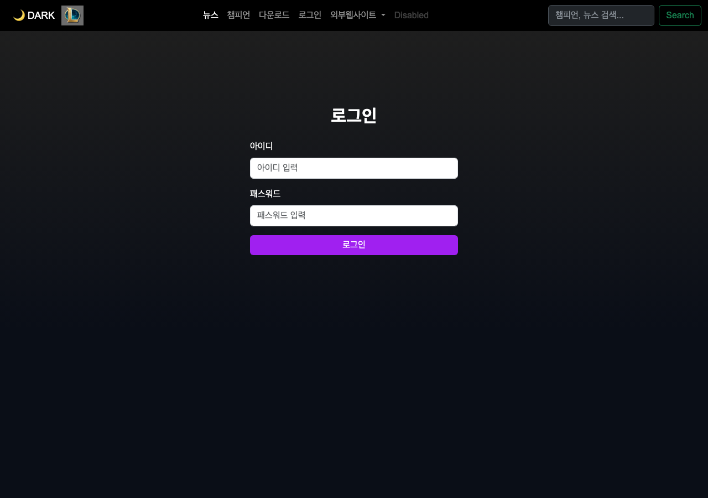

**② 로그인 페이지 라이트 모드 (과제)**
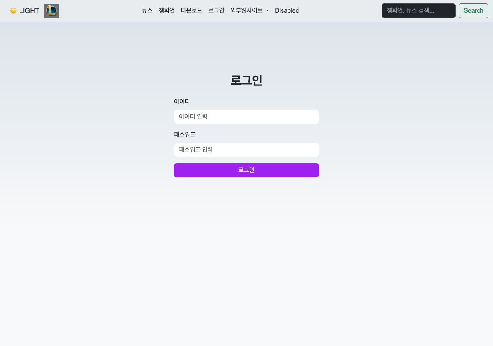

**③ 로그인 성공 후 페이지 (`/after_login`, 세션 인증 · 로그아웃 버튼)**
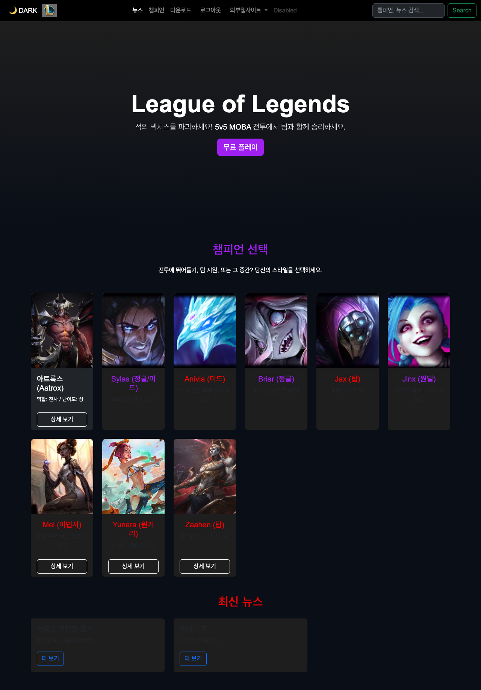

---

## 11주차 수업 내용 — 회원가입 & 암호화(SHA-256)

### PART 1. 트렌드 / 이론 (해시 암호화)
- **보안 사고**: 2024 인터파크 DB 해킹(1,030만 명 유출) — 주원인은 **패스워드 평문 저장**과 약한 암호화(MD5).
- **해시(단방향 암호화)**: 암호화만 가능하고 **복호화 불가**. 같은 입력은 항상 같은 해시값(결정론적). DB가 해킹돼도 원본 비밀번호 복구 불가.

| 알고리즘 | 길이 | 평가 |
|----------|------|------|
| MD5 | 128bit | 취약 ❌ |
| SHA-1 | 160bit | 취약 ❌ |
| **SHA-256** | 256bit | 적합 ✅ (오늘 실습) |
| bcrypt | 가변 | 강력(salt 포함, 실무) |

### PART 2. 회원가입 구현
- **`login.html`**: 로그인 버튼 아래에 **회원가입 버튼**(`/register`) 추가.
- **`User.java`**: `email`(`@Column(unique=true)` 중복 방지), `phone` 컬럼 추가 + `findByEmail()` 메서드. `DataSeeder`도 guest에 email/phone 추가.
- **`register.html` (신규)**: 회원가입 폼(아이디·패스워드·패스워드 확인·이메일·연락처) + 가입 확인 모달.
- **`AuthResource.java` 엔드포인트 추가**

| 메서드 / 경로 | HTTP | 동작 |
|---------------|------|------|
| `registerPage()` `/register` | GET | `register.html` 반환 |
| `registerCheck()` `/register_check` | POST | 아이디·이메일 **중복 체크** → 통과 시 DB 삽입(해시 저장) → `/register_success`. 중복 시 `/register?error=duplicate_username`(또는 `_email`) |
| `registerSuccess()` `/register_success` | GET | `register_success.html`(가입 완료) 반환 |

### PART 3. 암호화 (SHA-256) — 클라이언트 측 해싱
- **`js/input_check.js` (신규)**: 정규식 유효성 검사
  - 아이디 `^[a-zA-Z0-9]{4,20}$`, 패스워드 `^(?=.*[a-zA-Z])(?=.*\d)(?=.*[!@#$%^&*]).{8,}$`, 패스워드 확인 일치, 이메일, 연락처 `^010-\d{4}-\d{4}$`
  - 통과 시 `showConfirmModal()` 호출, 서버 중복 에러는 `?error=` 파라미터로 표시.
- **`js/input_sha256.js` (신규)**: 브라우저 내장 **Web Crypto API**(`crypto.subtle.digest('SHA-256', ...)`)로 패스워드를 해시 → hidden 필드(`name="password"`)에 저장 → 확인 모달 표시 → `submitRegister()`로 폼 전송.
- 결과: **서버에는 평문이 아닌 SHA-256 해시값만 전송·저장**된다. (DB의 `password` 컬럼 = 64자리 해시)

### PART 4. 마무리 & 과제
- ✅ **과제 — 로그인 화면 입력값 검사(`js/login.js`)**: 회원가입의 검증 로직을 참고해 `validateAndLogin()` 구현(아이디·패스워드 정규식). `login.html`의 입력 필드에 `usernameInput`/`passwordInput` id를 부여하고 로그인 버튼을 `validateAndLogin()` → `submitLogin()` 흐름으로 변경. (※ register의 `showError`는 파라미터 2개, login은 메시지 id까지 받는 3개 — 힌트의 "파라미터 개수가 틀림")

---

## 11주차 핵심 코드
**SHA-256 해시 생성 (`js/input_sha256.js`)**
```js
// 브라우저 내장 Web Crypto API로 단방향 해시(복호화 불가)
async function hashPassword(password) {
    const data = new TextEncoder().encode(password);
    const buf = await crypto.subtle.digest('SHA-256', data);
    return Array.from(new Uint8Array(buf))
        .map(b => b.toString(16).padStart(2, '0')).join('');  // 16진수 문자열
}
```
**회원가입 — 중복 체크 후 해시 저장 (`login/AuthResource.java`)**
```java
@POST @Path("/register_check") @Transactional
public Response registerCheck(@FormParam("username") String username,
        @FormParam("password") String password,   // 이미 SHA-256 해시값
        @FormParam("email") String email, @FormParam("phone") String phone) {
    if (User.findByUsername(username) != null)     // ① 아이디 중복
        return Response.seeOther(URI.create("/register?error=duplicate_username")).build();
    if (User.findByEmail(email) != null)           // ② 이메일 중복
        return Response.seeOther(URI.create("/register?error=duplicate_email")).build();
    User u = new User();                           // ③ DB 삽입(해시 저장)
    u.username = username; u.password = password;
    u.email = email; u.phone = phone; u.persist();
    return Response.seeOther(URI.create("/register_success")).build();
}
```

## 11주차 실제 실행 화면 (http://localhost:8080/)

**① 회원가입 폼 (`/register`)**
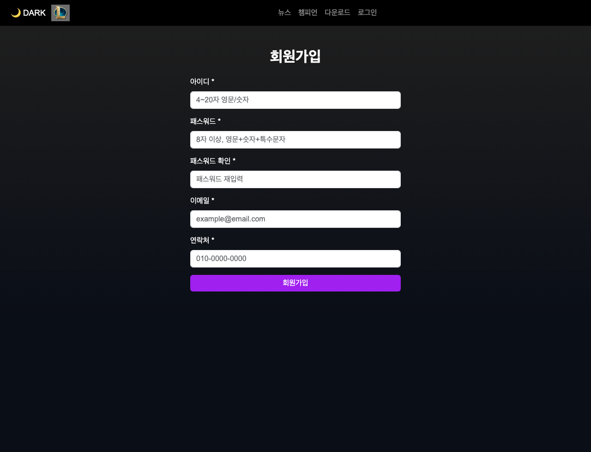

**② 가입 확인 모달 — 입력 정보 확인, 패스워드는 해시로 암호화 전송**
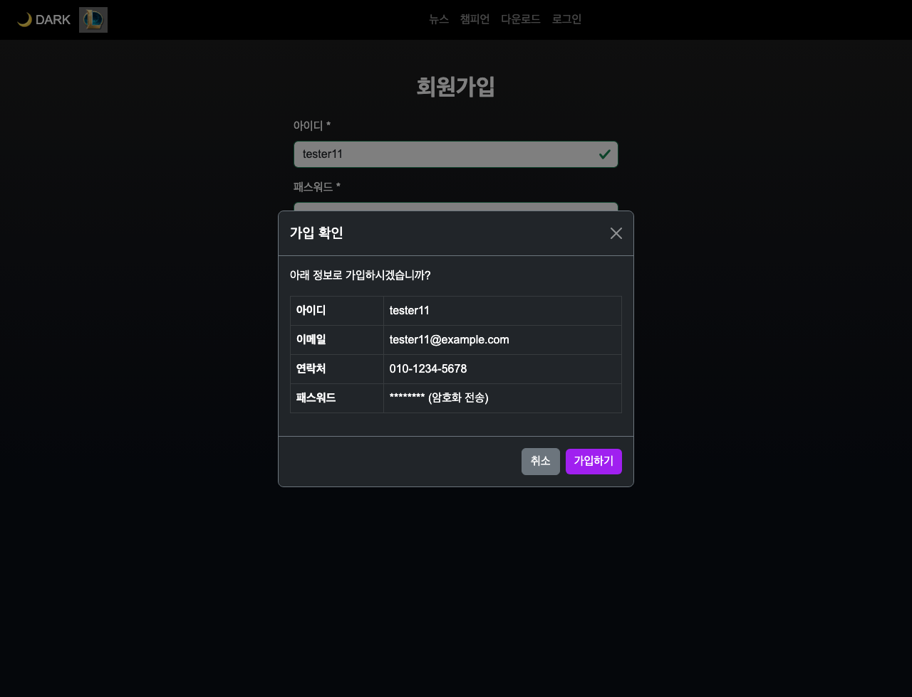

**③ 가입 완료 페이지 (`/register_success`)**
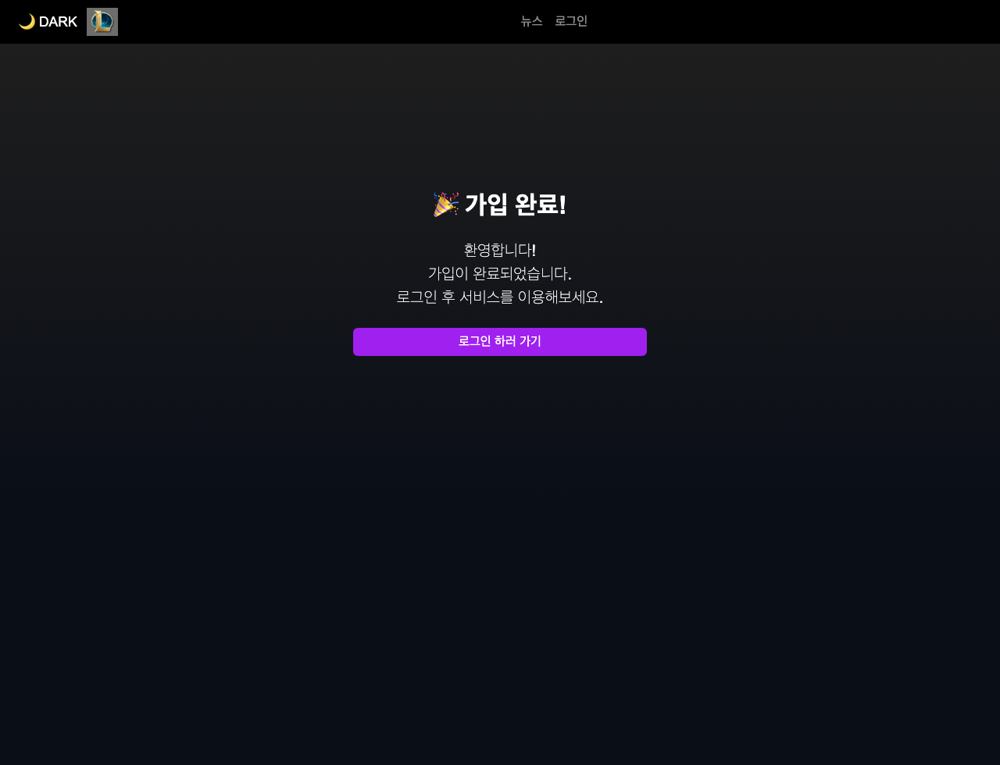

**④ 로그인 페이지 — 회원가입 버튼 추가 & 입력값 검증(과제)**
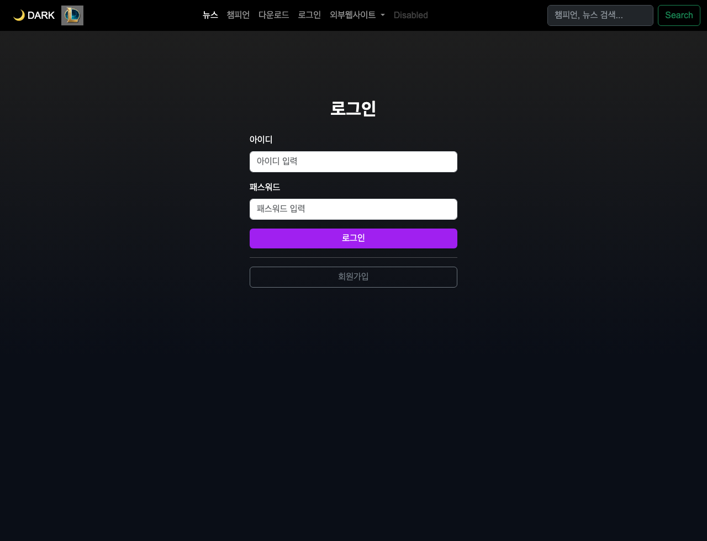

---

## 12주차 수업 내용 — 회원관리(로그인 암호화 체크 & 프로필 페이지)

### PART 1. 트렌드 / 이론 (콘텐츠 유형 · 파일 저장)
- HTTP Archive 2024/2025 통계: 용량은 **이미지(약 55%)·JS(약 34%)** 비중이 큼. 이미지는 **WebP/AVIF**(고해상도·저용량) 권장.
- 콘텐츠 유형: 정적(HTML/CSS/JS/이미지) · 동적(REST API) · DB · 미디어(업로드).
- 실서비스(카카오·네이버·당근 등)는 **파일은 클라우드/CDN(S3 등)에 저장하고 DB엔 파일명/URL만 저장**. 이번 주는 축소판으로 **서버 로컬에 이미지 저장 + DB에 파일명 저장**.

### PART 2-1. 로그인 암호화 체크 (해시 비교 완성)
- 11주차까지는 회원가입만 SHA-256 해시였고 로그인은 평문 비교라 **신규 계정 로그인이 안 되는 문제**가 있었음 → 이번 주에 해결.
- **`login.html`**: 보이는 패스워드 입력(`passwordInput`)과 별도로, 해시값을 담는 **hidden 필드(`id="password" name="password"`)** 추가. `input_sha256.js` 연동.
- **`js/login.js`**: `submitLogin()`을 비동기로 변경 → `hashPassword()`로 **SHA-256 해시 생성 후 hidden 필드에 담아 전송**. 서버는 해시값끼리 비교.
- **guest 계정**: 평문 `123123` → 해시값으로 교체. `DataSeeder`도 해시 저장, 기존 DB도 `UPDATE ... LOWER(password)` 로 갱신. **로그인: `guest` / `123qwe@@@`**

### PART 2-2. 메인화면 세션 체크 (로그인 상태 유지)
- `Index.html` → **`main_index.html`** 로 이름 변경(정적 `index.html` 자동 서빙을 막고 백엔드가 `/`를 처리).
- **`AuthResource.mainPage()` (`GET /`)**: 세션 유무에 따라 분기 — 로그인 상태면 `main_after_login.html`, 비로그인이면 `main_index.html` 반환. → 로그인 후 메인에 **프로필·로그아웃 버튼**이 유지됨.

### PART 2-3. 프로필 페이지
- **`main_after_login.html`**: 네비바에 **프로필 링크**(`/profile`) 추가.
- **`User.java`**: `profileImage`(저장 파일명) 컬럼 추가.
- **`profile.html` (신규)**: 프로필 사진(원형) + 개인정보 표 + 사진 업로드 폼(`multipart/form-data`).
- **`js/Profile.js` (신규)**: `fetch('/profile/info')`로 사용자 정보를 비동기로 받아와 DOM에 출력(아이디/이메일/연락처/사진).
- **`AuthResource` 엔드포인트 추가**

| 메서드 / 경로 | HTTP | 동작 |
|---------------|------|------|
| `profilePage()` `/profile` | GET | 세션 체크 → DB 조회 → `profile.html` 반환(미로그인 시 `/login`) |
| `profileInfo()` `/profile/info` | GET | 로그인 사용자 정보를 **JSON**으로 반환(미로그인 401) |
| `profileUpload()` `/profile/upload` | POST | `@RestForm FileUpload` — 확장자(jpg/png/gif/webp)·크기(5MB) 검사 → **UUID 파일명**으로 `uploads/profile/`에 저장 → DB에 파일명 갱신 |

### PART 3. 마무리 & 과제
- ✅ **과제 — 로그인 화면 세션 중복 처리**: 이미 로그인한 상태에서 `/login` 재접속 시 새 세션이 또 생기던 문제를, `loginPage()`에서 **세션이 있으면 `/after_login`으로 자동 전환**하도록 수정(`mainPage()`의 세션 체크 재활용).

---

## 12주차 핵심 코드
**로그인도 해시 후 전송 (`js/login.js`)**
```js
async function submitLogin() {
    const pw = document.getElementById('passwordInput').value;
    document.getElementById('password').value = await hashPassword(pw); // 평문 대신 해시
    document.getElementById('loginForm').submit();                      // POST /login_check
}
```
**메인 세션 분기 — `GET /` (`login/AuthResource.java`)**
```java
@GET @Produces(MediaType.TEXT_HTML)
public Response mainPage() {
    String loginUser = context.session().get("loginUser");
    String path = (loginUser != null)
        ? "META-INF/resources/login/main_after_login.html"   // 로그인 O
        : "META-INF/resources/main_index.html";              // 로그인 X
    return Response.ok(getClass().getClassLoader().getResourceAsStream(path)).build();
}
```
**프로필 사진 업로드 — 검증 + UUID 저장 (`login/AuthResource.java`)**
```java
@POST @Path("/profile/upload") @Transactional
@Consumes(MediaType.MULTIPART_FORM_DATA)
public Response profileUpload(@RestForm("profileImage") FileUpload file) {
    String ext = file.fileName().substring(file.fileName().lastIndexOf('.') + 1).toLowerCase();
    if (!ext.matches("jpg|jpeg|png|gif|webp"))                 // 확장자 검사
        return Response.seeOther(URI.create("/profile?error=invalid_type")).build();
    if (file.size() > 5 * 1024 * 1024)                         // 5MB 크기 검사
        return Response.seeOther(URI.create("/profile?error=too_large")).build();
    String newName = UUID.randomUUID() + "." + ext;            // UUID 파일명
    Files.copy(file.uploadedFile(), uploadDir.resolve(newName), StandardCopyOption.REPLACE_EXISTING);
    User.findByUsername(loginUser).profileImage = newName;     // DB에 파일명 저장
    return Response.seeOther(URI.create("/profile")).build();
}
```

## 12주차 실제 실행 화면 (http://localhost:8080/)

**① 로그인 페이지 (입력 검증 + SHA-256 해시 전송)**
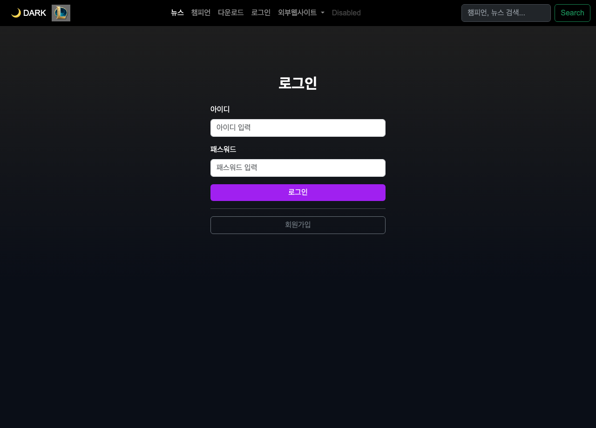

**② 로그인 후 메인 — 세션 분기로 프로필·로그아웃 버튼 유지**
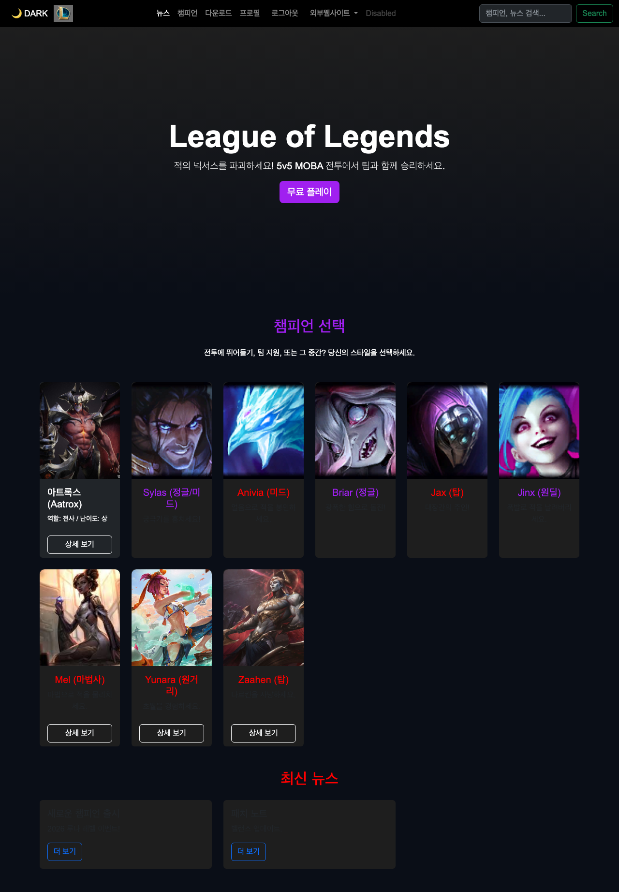

**③ 프로필 페이지 — 정보 조회(JSON) + 사진 업로드 폼**
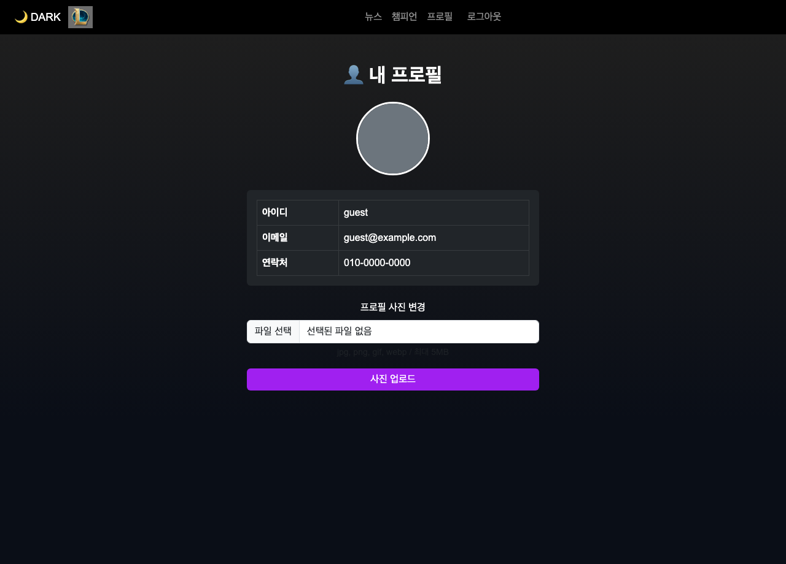

---

## 13주차 수업 내용 — 회원정보 수정 / 비밀번호 변경 + Toast

### PART 1. 트렌드 / 이론 (개인정보 보호)
- 2025 개인정보 유출(쿠팡·SKT 등) — 평문/약한 암호화 저장이 피해를 키움. 민감정보(주민번호·금융·의료)와 결합 가능 정보의 위험, AI 시대의 노출/악용(딥페이크·보이스피싱) 이슈. → **외부 전송 최소화·로컬 처리** 등 프라이버시 보호 방향.

### PART 2-1. 프론트 개선 — Toast 알림 & 사용자명 표시
- 브라우저 기본 `alert()`(화면 차단)을 **Bootstrap Toast**(비방해형, 자동 사라짐)로 교체.
- `js/test.js`에 `showToast(message, type)` 함수 추가, 각 페이지에 **Toast 컨테이너** HTML 삽입.
- 네비바 프로필 링크에 **Tooltip**으로 로그인 사용자명 표시(`Profile.js`가 `/profile/info`를 fetch 후 `data-bs-title` 동적 설정).

### PART 2-2. 회원정보 수정 (이메일·연락처)
- `profile.html`: Bootstrap **Collapse**로 "개인정보 수정" 폼을 접기/펼치기. 폼에는 기존 값이 자동으로 채워짐.
- `Profile.js`: `validateAndUpdate()` — 이메일/연락처 정규식 검사 후 전송. 결과는 `?success=updated` / `?error=duplicate_email` 파라미터로 메시지 표시.
- `AuthResource.profileUpdate()` (`POST /profile/update`): 세션 체크 → **이메일 중복(본인 제외) 체크** → DB 업데이트.

### PART 2-3. 비밀번호 변경 (+ 변경 후 자동 로그아웃)
- `profile.html`: 현재/새/새 확인 비밀번호 폼(입력값은 보이는 필드, 전송은 **해시 hidden 필드**).
- `Profile.js`: `validateAndChangePassword()` — 현재 비번 입력 체크 + 새 비번 정규식 + 일치 검사 → **현재·새 비번 모두 SHA-256 해시** 후 전송.
- `AuthResource.profilePassword()` (`POST /profile/password`): 현재 비번 해시 비교 → 일치 시 새 해시로 DB 업데이트(`?success=password_changed`), 불일치 시 `?error=wrong_password`.
- 변경 성공 시 Toast 후 **3.5초 뒤 자동 로그아웃** → `logout(@QueryParam("next"))`가 `?next=login`이면 `/login`으로 이동.

### PART 3. 마무리 & 과제
- ✅ **과제 — alert 전체 Toast 교체**: `main_index.html`(로딩/무료플레이), `main_after_login.html`(로그인 성공!/무료플레이), `register.html`·`register_success.html`(페이지 로딩/가입 완료)의 alert를 모두 `showToast()`로 교체, `login.html`은 로딩 alert 제거.
- ✅ **마무리 정리**: 중복 `window.onload` alert 제거, 네비바/스크립트 로드 순서·상대경로 점검.

## 13주차 핵심 코드
**Toast 함수 (`js/test.js`)**
```js
function showToast(message, type = 'success') {       // type: success/danger/warning
    const toastEl = document.getElementById('liveToast');
    const toastBody = document.getElementById('toastBody');
    if (!toastEl || !toastBody) return;
    toastEl.className = `toast align-items-center text-white bg-${type} border-0`;
    toastBody.textContent = message;
    new bootstrap.Toast(toastEl, { delay: 3000 }).show();   // 3초 후 자동 사라짐
}
```
**비밀번호 변경 — 검증 + 해시 (`js/Profile.js`)**
```js
async function validateAndChangePassword() {
    /* 현재 비번 빈값·새 비번 정규식·새 비번 일치 검사 ... valid 판정 */
    if (!valid) return;
    document.getElementById('currentPassword').value = await hashPassword(currentPw); // 해시
    document.getElementById('newPassword').value     = await hashPassword(newPw);     // 해시
    document.getElementById('pwForm').submit();
}
```
**회원정보 수정 / 비번 변경 엔드포인트 (`login/AuthResource.java`)**
```java
@POST @Path("/profile/update") @Transactional
public Response profileUpdate(@FormParam("email") String email, @FormParam("phone") String phone) {
    String loginUser = context.session().get("loginUser");
    if (loginUser == null) return Response.seeOther(URI.create("/login")).build();
    User found = User.findByEmail(email);                          // 이메일 중복(본인 제외)
    if (found != null && !found.username.equals(loginUser))
        return Response.seeOther(URI.create("/profile?error=duplicate_email")).build();
    User user = User.findByUsername(loginUser);
    user.email = email; user.phone = phone;                       // DB 업데이트
    return Response.seeOther(URI.create("/profile?success=updated")).build();
}

@POST @Path("/profile/password") @Transactional
public Response profilePassword(@FormParam("currentPassword") String cur,
                                @FormParam("newPassword") String neo) {
    User user = User.findByUsername(context.session().get("loginUser"));
    if (!user.password.equals(cur))                               // 현재 비번 해시 비교
        return Response.seeOther(URI.create("/profile?error=wrong_password")).build();
    user.password = neo;                                          // 새 해시로 변경
    return Response.seeOther(URI.create("/profile?success=password_changed")).build();
}

@GET @Path("/logout")
public Response logout(@QueryParam("next") String next) {         // ?next=login → /login
    context.session().destroy();
    return Response.seeOther(URI.create("login".equals(next) ? "/login" : "/")).build();
}
```

## 13주차 실제 실행 화면 (http://localhost:8080/)

**① Toast 알림 — 로그인 성공!(자동 사라지는 비방해형 알림)**
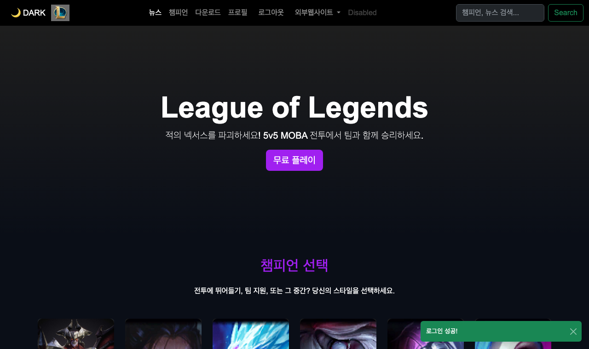

**② 프로필 — 개인정보 수정(Collapse) + 비밀번호 변경 폼**
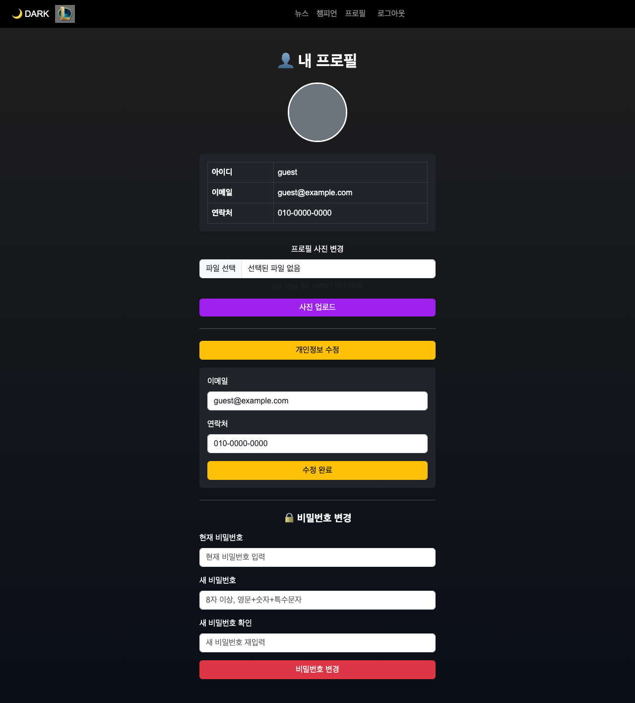

---

# 📚 기말고사 정리 (9~13주차 요약 · 시험 대비)

> 회원관리 시스템(로그인·세션·암호화·DB·프로필)의 핵심을 압축 정리.

## 1) 자료구조 & DB 연동 (9주차)
- **V8 엔진**: 단순 인터프리터 → **다단계 JIT 컴파일러**(`Parser → AST → Ignition(바이트코드) → TurboFan(Hot Code 최적화)`). **WebAssembly(WASM)** = 고성능 처리(게임·AI), 기계어 수준.
- **객체 배열 vs 일반 배열**: 객체 배열 `[{key:value}]`은 의미가 명확(`arr[0].name`), 필터링·확장에 유리 / 일반 배열 `[v,v]`는 단순·빠름(`includes`).
- **다크/라이트 모드**: `classList.toggle('light-mode')` 한 줄로 전체 테마 전환.
- **MySQL 연동(★)**: `pom.xml`에 `quarkus-jdbc-mysql`·`hibernate-orm-panache`·`rest-jackson` 추가, `application.properties`에 DB 접속·`hibernate-orm.database.generation=update`.
  - **Panache(Active Record)**: `@Entity` + `extends PanacheEntity` → `id` 자동 + `listAll()`/`persist()`/`find()` 제공. SQL 없이 DB 조작.
  - 3계층: **Entity(Model)** · **Resource(Controller, REST API)** · **DataSeeder(초기 데이터)**. `/champions` → DB 데이터를 **JSON** 응답.

## 2) 로그인 / 로그아웃 — 세션 (10주차)
- **웹 보안**: 세션 쿠키 탈취 = 비밀번호 없이도 로그인됨. HTTP는 **무상태(stateless)** → 서버가 세션 관리, 브라우저엔 세션 ID(쿠키)만.
- **세션 vs 토큰(JWT)**: 세션=서버 저장(확장성↓), 토큰=클라이언트 저장(stateless).
- **세션 구현**: `SessionConfig`(Vert.x `Router`에 `SessionHandler` 등록), `AuthResource` — `login_check`(DB 인증 → `session.put`), `after_login`(세션 없으면 차단=Forced Browsing 방지), `logout`(`session.destroy`).
- **HTTP 상태코드**: 200(성공) / **302**(이동, 메서드 유지) / **303 See Other**(POST→GET 전환, 로그인 후 이동) / 404 / 5xx.
- **도메인 패키지 구조**: 기능별 폴더(`champion`/`common`/`login`)로 응집도↑.

## 3) 회원가입 & 암호화 (11주차)
- **해시(단방향)**: 암호화만 가능·**복호화 불가**. 같은 입력=같은 해시. DB 유출돼도 원본 복구 불가.
- **알고리즘**: MD5/SHA-1(취약) ❌ → **SHA-256**(적합) ✅ → bcrypt(실무, salt).
- **클라이언트 해싱**: 브라우저 **Web Crypto API**(`crypto.subtle.digest('SHA-256')`)로 패스워드를 해시 → hidden 필드로 전송(평문 전송 X).
- **유효성 검사(정규식)**: 아이디 `^[a-zA-Z0-9]{4,20}$`, 패스워드 `^(?=.*[a-zA-Z])(?=.*\d)(?=.*[!@#$%^&*]).{8,}$`, 이메일/연락처(`^010-\d{4}-\d{4}$`).
- **회원가입 처리**: `register_check` — 아이디·이메일 **중복 체크** 후 해시 저장. `User`에 `@Column(unique=true) email`·`phone` 추가.

## 4) 회원관리 — 세션분기 & 프로필 (12주차)
- **콘텐츠 유형**: 정적(HTML/CSS/JS/이미지)·동적(REST API)·DB·미디어. 실서비스는 파일을 **CDN/S3**에 저장, DB엔 파일명만.
- **로그인 해시 비교 완성**: `login.js`의 `submitLogin()`이 패스워드를 SHA-256 해시 후 전송 → 서버가 해시끼리 비교(가입과 일치).
- **메인 세션 분기(★)**: `Index.html` → **`main_index.html`** 로 변경(정적 index 자동 서빙 차단), `AuthResource.mainPage()`(`GET /`)가 세션 유무로 `main_after_login.html`(로그인) / `main_index.html`(비로그인) 반환.
- **프로필**: `profile.html` + `Profile.js`(`fetch('/profile/info')`로 정보 표시), `User.profileImage` 컬럼. `/profile/upload` — `@RestForm FileUpload`로 확장자·크기(5MB) 검사 후 **UUID 파일명**으로 로컬 저장 + DB에 파일명.
- **Active Record vs Data Mapper**: Panache(Active Record)=객체가 DB 로직 보유, 코드 적음 / JPA Repository(Data Mapper)=분리, 코드 많음.

## 5) 회원정보 수정·비밀번호 변경 + Toast (13주차)
- **Toast vs alert**: `alert()`는 화면 차단·버튼 필수 / **Toast**는 비방해형·자동 사라짐(실무 표준). `showToast(msg, type)` + Toast 컨테이너 HTML.
- **Bootstrap 컴포넌트**: **Collapse**(접기/펼치기, 개인정보 수정 폼), **Tooltip**(네비바 사용자명).
- **회원정보 수정**: `/profile/update` — 이메일 **중복 체크(본인 제외)** 후 DB 수정.
- **비밀번호 변경**: `/profile/password` — 현재 비번 **해시 비교** → 새 해시 저장. 변경 성공 시 Toast 후 `setTimeout`으로 3.5초 뒤 **자동 로그아웃**(`logout?next=login` → `/login`). `@QueryParam("next")`로 분기.

## ✅ 시험 빈출 체크리스트
- **세션 vs 토큰**, HTTP **무상태**, 세션 쿠키의 역할
- **HTTP 상태코드** 302 vs **303**(POST→GET), 200/404/5xx
- **해시(SHA-256)** 가 단방향(복호화 불가)인 이유, MD5/SHA-1이 취약한 이유
- **Panache** = Active Record, `@Entity`/`PanacheEntity`/`@Transactional`/`persist()`
- **메인 세션 분기**를 위해 `index.html`을 왜 바꿨는가(정적 우선 인식)
- **`@FormParam` / `@RestForm` / `@QueryParam` / `@Path` / `@Produces`** 어노테이션 역할
- **정규식** 패스워드 규칙, 중복 체크(본인 제외) 로직
- **Toast vs alert**, Collapse·Tooltip, `preventDefault`/`fetch`/`setTimeout`
- **파일 업로드**: `multipart/form-data`, 확장자·크기 검증, UUID 파일명, DB엔 파일명만 저장

---

<div align="center">
